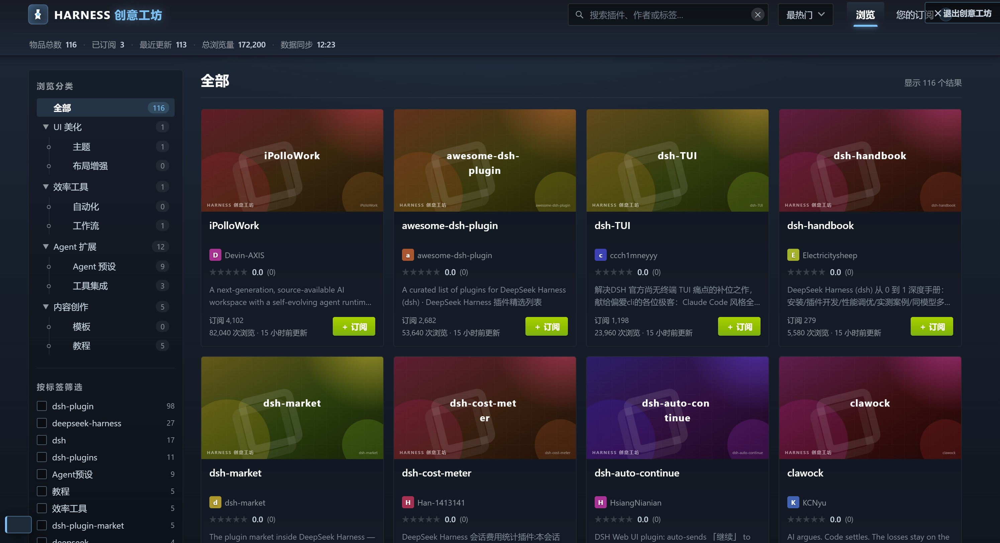

# Harness 创意工坊

为 DeepSeek Harness 打造的插件市场：复刻 Steam 创意工坊的浏览、筛选、订阅与安装体验，管理和分发 Harness 扩展功能（主题、效率工具、Agent 预设、教程等）。



## 功能

- **浏览与检索**：综合热度/订阅数/更新时间/评分/浏览量五种排序，全局搜索，分类树 + 标签过滤
- **订阅管理**：订阅状态本地持久化，卡片/统计/徽章实时联动
- **真实安装**：在 DSH web 内订阅即自动安装——host 下载校验 → 写入 profile 依赖与 patch 行 → `pnpm install`，刷新页面生效；取消订阅自动卸载
- **GitHub 实时同步**：每 6 小时自动扫描 `topic:dsh-plugin` 新仓库并入列，打开工坊即拉取最新（缓存过期自动刷新，也可手动 `POST /api/harness-workshop/refresh`）
- **详情页**：简介、更新日志、评论、GitHub 源码入口
- **零依赖**：纯 HTML/CSS/JS，双击 `index.html` 即可离线运行

## 安装到 DSH

1. 构建客户端 bundle：`npm run build`
2. 在 web profile（`$DSH_HOME/profiles/web`）的 `package.json` 添加依赖：

   ```json
   "harness-workshop": "link:本仓库路径"
   ```

3. 在 `cordis.patch.yml` 追加一行：

   ```yaml
   - insert:
       - id: harness-workshop
         name: harness-workshop
   ```

4. 在 profile 目录执行 `pnpm install`，重启 DSH web（或等待 patch 热重组合），刷新页面后侧边栏底部出现「创意工坊」入口

> 独立运行预览：`npm run serve`，浏览器打开 http://127.0.0.1:8357

## 数据来源

条目来自 GitHub `topic:dsh-plugin` 真实仓库，seed 数据在 `mock-data/workshop_items.json`。手动刷新：

```bash
npm run fetch      # 从 GitHub 拉取最新仓库数据（合并入 mock-data）
npm run refresh    # fetch + 重建封面/数据/bundle
```

## 开发

```bash
npm run serve     # 本地预览（http://127.0.0.1:8357）
npm run build     # 重建封面、内嵌数据与 DSH 客户端 bundle
npm test          # DOM 冒烟测试（需先 serve）
```

## License

[MIT](LICENSE)
